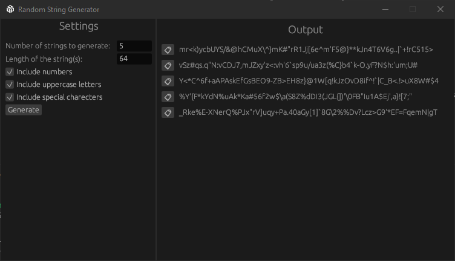

# Random String Generator

This workspace contains a Random String Generator implemented in Rust. It provides both a command-line interface (CLI) and a graphical user interface (GUI) for generating random strings with customizable options.

## Features

- Generate multiple random strings at once
- Customize string length
- Include or exclude special characters, numbers, and uppercase letters
- CLI for command-line usage
- GUI for desktop application usage

## Project Structure

The workspace consists of the following components:

1. `common`: A library crate containing the core `RandomStringGenerator` struct and its implementation.
2. `cli`: A binary crate providing a command-line interface.
3. `gui`: A binary crate providing a graphical user interface using the `eframe` library.

## Installation

To build and run this project, you need to have Rust and Cargo installed on your system. If you don't have them installed, you can get them from [rustup.rs](https://rustup.rs/).

Clone the repository and build the project:

```bash
git clone https://github.com/Hisham743/random_string_generator.git
cd random-string-generator
cargo build --release
```

## Usage

### CLI

To use the command-line interface:

```bash
cargo run --bin cli -- [OPTIONS]
```

#### Options

`-c, --count <COUNT>`: Number of strings to generate (default: 5)

`-l, --length <LENGTH>`: Length of the strings (default: 32)

`--exclude-special-chars`: Exclude special characters from the generated strings

`--exclude-numbers`: Exclude numbers from the generated strings

`--exclude-uppercase`: Exclude uppercase letters from the generated strings

#### Example

```bash
cargo run --bin cli -- -c 3 -l 16 --exclude-special-chars
```

Output

```text
SHMdS4AuVLWrnxq7

wpFWxTNNDcyZTAZ9

DHpiiXambklmkoq3
```

### GUI



To run the graphical user interface:

```bash
cargo run --bin gui
```

The GUI allows you to:

Set the number of strings to generate
Set the length of the strings
Toggle inclusion of numbers, uppercase letters, and special characters
Generate strings and copy them to clipboard

## Development

To run tests:

```bash
cargo test
```

## License

This project is licensed under the MIT License - see the [LICENSE](LICENSE) file for details.
